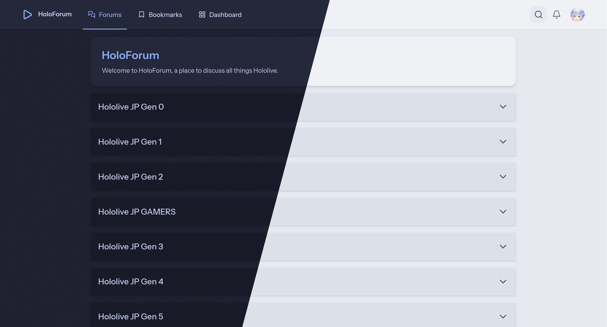
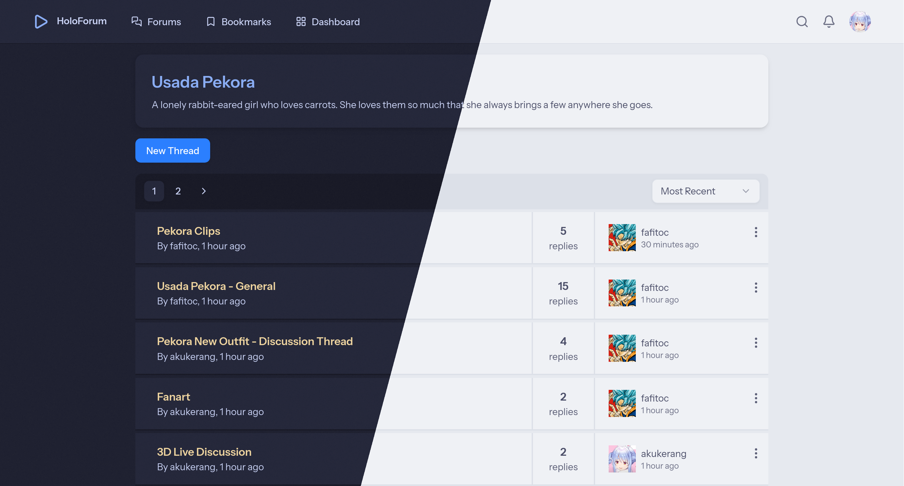
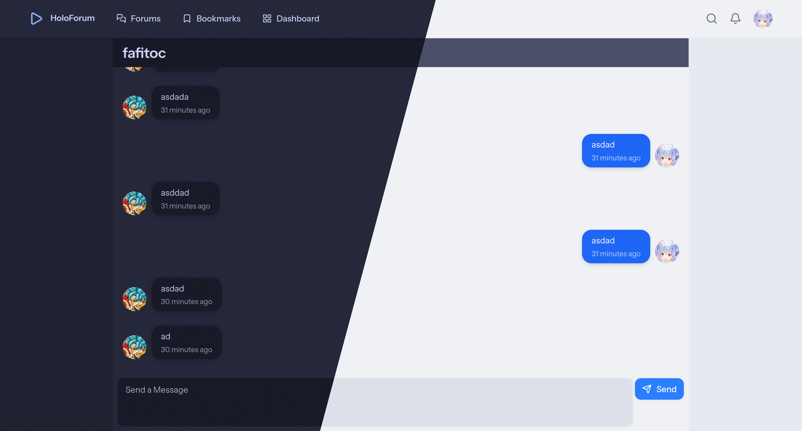

# HoloForum

A full stack forum website built with **Laravel** and **React**.

## Features

- **Authentication**: Secure login and registration
- **Direct Messaging**: Realtime messaging
- **Notifications**: Realtime notifications
- **Profiles**: Customizable user profiles
- **Moderation Tools**: Lock and remove posts and threads, and ban users.
- **Search**: Filter threads and posts by keywords, users, or forum
- **Threads**: Create and manage discussion threads
- **Posts**: Replies to a thread
- **Reaction**: Like system for posts
- **Bookmarks**: Get notifications for new posts in bookmarked threads

## Pictures

<p align="center">
  
  
</p>

<p align="center">
  
  
</p>

## Stack

- **Frontend**: React, Tailwind, ShadCN
- **Backend**: Laravel 12, SQLite

## Installation

1. Clone the repository

```bash
git clone https://github.com/akukerang/HoloForum
cd HoloForum
```

2. Backend Setup

```bash
composer install
cp .env.example .env
php artisan key:generate
php artisan migrate
```

3. Frontend Setup

```bash
npm install
npm run build
```

4. Start the server

```bash
composer run dev
```

Runs on `http://localhost:8000/`

## Useful Commands

Regenerates slugs for forums

```bash
php artisan app:generate-forum-slugs
```

Gives user the admin role

```bash
php artisan app:make-admin {username}
```
